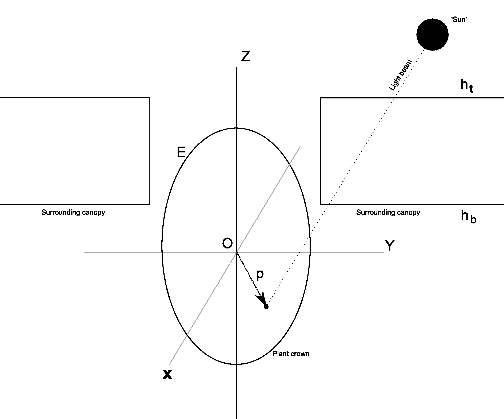

# PHOLIAGE
Photosynthesis and Light Absorption Model

## Details

This is a model that calculates light absorption and photosynthesis for trees in opened canopies (e.g. for enrichment planting).

### Literature
[Van Kuijk _et al._, 2014.](https://www.researchgate.net/publication/264199801_Stimulating_seedling_growth_in_early_stages_of_secondary_forest_succession_A_modeling_approach_to_guide_tree_liberation) Stimulating seedling growth in early stages of secondary forest succession: A modeling approach to guide tree liberation

[Van Kuijk _et al._, 2008.](https://www.researchgate.net/publication/5264252_The_limited_importance_of_size-asymmetric_light_competition_and_growth_of_pioneer_species_in_early_secondary_forest_succession_in_Vietnam) The limited importance of size-asymmetric light competition and growth of pioneer species in early secondary forest succession in Vietnam

## Implementation details

### Lazarus / Delphi

The original version was written in Delphi. This is the version ported to Lazarus / FPC.

Main functional changes
- Supports multiple platforms (Linux, Windows, and macOS).
- Reads *.xls, *.xlsx, and *.odt files natively (previous version used Windows-only Excel OLE automation).
- Removed Windows/Delphi-specific multithreading code (too much work to port).
- Removed some initial code for a planned extension for lane-based simulations.

For further details, see the changelog.

### Numerical differences between versions

If model result differ slightly between Linux/Win32 builds and Win64 builds. The Linux/Win32 results are exactly the same as the results from the old Delphi version. The reason results on Win64 are different is that on Win64 the 80-bit floating point _Extended_ datatype is not supported. The Math unit therefore internally uses Double (64 bit) instead of Extended, leading to minute differences. This is no problem, the loss in precision is negligible, and the StratiPHOLIAGE model itself uses Double for all calculations anyway. For details see for example [this forum post](http://forum.lazarus.freepascal.org/index.php?topic=29678.0), and the source code of the Math unit.

## Running

In time, binary releases should become available via the 'releases' page.

### Usage

The `/doc` directory contains model documentation and a program manual.

## Compiling/Modifying

1. Install [Lazarus](https://www.lazarus-ide.org/)
2. Install [FPSpreadSheet](http://wiki.freepascal.org/FPSpreadsheet)
3. Check out the sources ('Clone or download' button above)
4. Open project file `PHOLIAGE.lpi` in Lazarus and press F9 to run.
